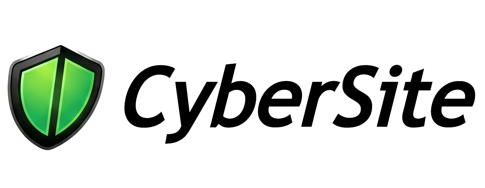

# VFN-CyberSite
<p align="center">
  
</p>
The official vulnerability assessment and security auditing platform for web applications and source code, engineered by VFN Media Lab.

> **Developed by VFN Media Lab, this project is designed to benefit programmers and enhance website security; it is not intended for hacking any websites.**

[](LICENSE)
[](https://nodejs.org/)

---

## What is VFN-CyberSite?

VFN-CyberSite is an enterprise-grade security auditing platform engineered to empower developers, organizations, and security teams to proactively identify, analyze, and remediate web vulnerabilities and source code flaws.

It does two main things:
1. **URL Scanner**: Tests a live website for vulnerabilities like SQL injection, XSS, exposed config files, and missing security headers.
2. **Code Scanner**: Scans your source code files (JavaScript, Python, PHP, Java, Go, etc.) for leaked API keys, hardcoded passwords, and unsafe code.

---

## How to Run It

### 1. Requirements
Make sure you have [Node.js](https://nodejs.org/) (version 18 or newer) installed.

### 2. Install & Start
```bash
git clone https://github.com/VFN-Lab/VFN-CyberSite.git
cd VFN-CyberSite
npm install
npm start
```

Now open your browser and go to:
```
http://localhost:3000
```

---

## How to Use

### Scanning a Website (URL Mode)
1. Type your website URL in the search box (e.g., `https://mywebsite.com`).
2. Click **Start Scan**.
3. **Verify Ownership**: To prevent scanning sites you do not own, the tool asks you to upload a simple text file (`security-scanner-verification.txt`) to your site root:
   ```
   Security Scanner Verification

   Domain:
   mywebsite.com

   Token:
   security-token-xxxxxx
   ```
4. Once uploaded to `https://mywebsite.com/security-scanner-verification.txt`, click **Verify & Start Scan**.
5. Watch the scan run in real-time and review the results with fix recommendations.

### Scanning Source Code (Code Mode)
1. Switch to **Code Scanner** mode.
2. Drag and drop your code files or paste a snippet.
3. Click **Scan Code** to see line-by-line security issues and leaked secrets.

---

## What Does It Check?

### Website Checks
- **Common Vulnerabilities**: SQL Injection, XSS, Path Traversal, and SSRF.
- **Exposed Files**: Hidden directories, `.git`, `.env` files, and database backups.
- **Server Configuration**: SSL certificate validity, HTTP security headers, and open ports.
- **Forms & Uploads**: Unsafe file upload forms and weak login cookies.

### Code Checks
- Leaked API keys, database credentials, and secret tokens.
- Unsafe functions and raw SQL queries.
- Supported languages: JS, TS, Python, PHP, Java, C#, Go, Ruby, SQL, HTML.

---

## Official Safety Notice

The official version of VFN-CyberSite is strictly safe and defensive:
- It **only** scans websites that you own and verify via the verification file.
- It will not scan random or third-party websites.
- Any modified versions or copies that remove this domain verification are **not official releases** of VFN-CyberSite.

---

## Disclaimer

This tool is created for educational purposes and authorized security testing only. Always get written permission before testing any system you do not own.

The authors and VFN Media Lab are not responsible for any misuse of this tool.

---

## License

[MIT](LICENSE) © 2026 VFN Media Lab & CyberSite Contributors
